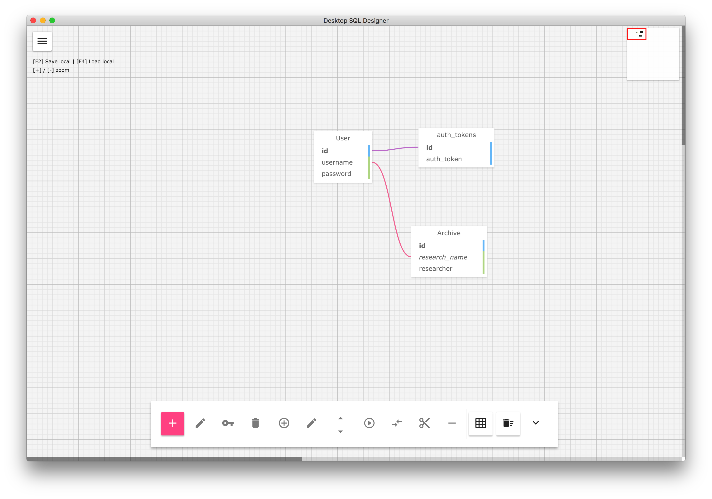
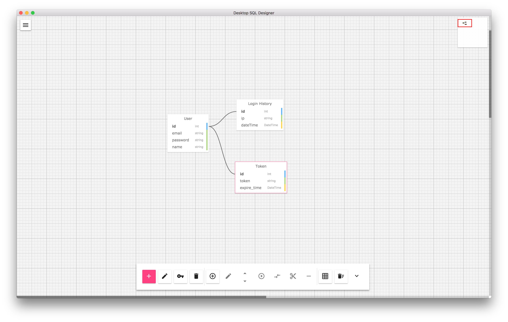
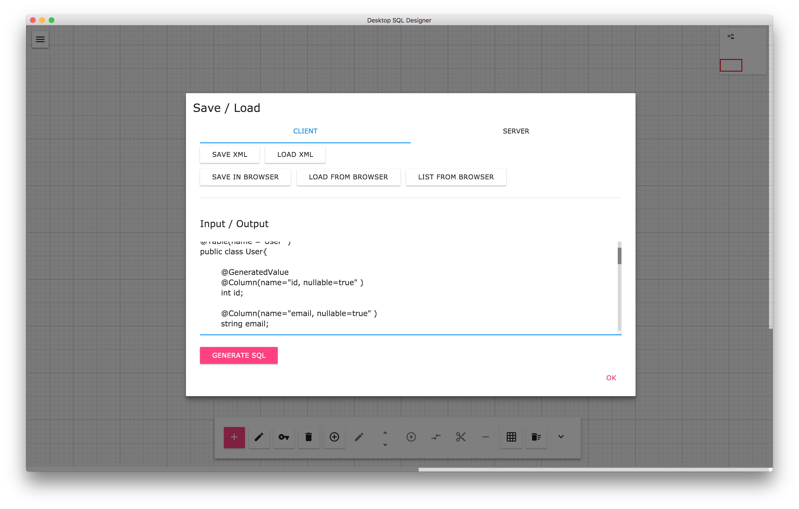

# sqldesigner


This project is desktop application of WWW SQL Designer. This project uses Lt-Mayonesa/sqldesigner repository, which re-designed WWW SQL designer

WWW SQL Designer allows users to create database designs, which can be saved/loaded and exported to SQL scripts. Various databases and languages are supported. Ability to import existing database design.

[WWW SQL Designer](https://github.com/ondras/wwwsqldesigner)

[Lt-Mayonesa/sqldesigner](https://github.com/Lt-Mayonesa/sqldesigner)


# About

Hi and welcome to WWW SQL Designer! This tool allows you to draw and create database schemas (E-R diagrams) directly in browser, without the need for any external programs (flash). You only need JavaScript enabled.
The Designer works perfectly in Chrome, Mozilla (Firefox, Seamonkey), Internet Explorer, MS Edge, Safari and Opera.

Many database features are supported, such as keys, foreign key constraints, comments and indexes. You can either save your design (for further loading & modifications), print it or export as SQL script. It is possible to retrieve (import) schema from existing database.

WWW SQL Designer was created by [Ondrej Zara]

re-designed SQL Desginer was create by [Lt-Mayonesa]

## Screenshot



## Added Features

* Packaged as Cross-Platform application (OSX, Window, Linux)

* Save workspace file at local

* Configuration save at local

* JPA Entity Class export

Example usage of JPA Entity class export)



output: 



## Supported platform

* OSX

* Linux

* Windows

## How to Install

Check relase of this repo.

## Known Issues

* Unable to close application by clicking close button in application window

***Please press Control(CMD in OSX) + Q to close application ***

## Dev

```
$ npm install
```

### Run from source

```
$ npm start
```

### Build

```
$ npm run build
```

Builds the app for macOS, Linux, and Windows, using [electron-packager](https://github.com/electron-userland/electron-packager).

## Release Versions

* 0.1.0 -> First Release

## License

BSD-3 © [ParkJaesung](http://private12.github.io)
